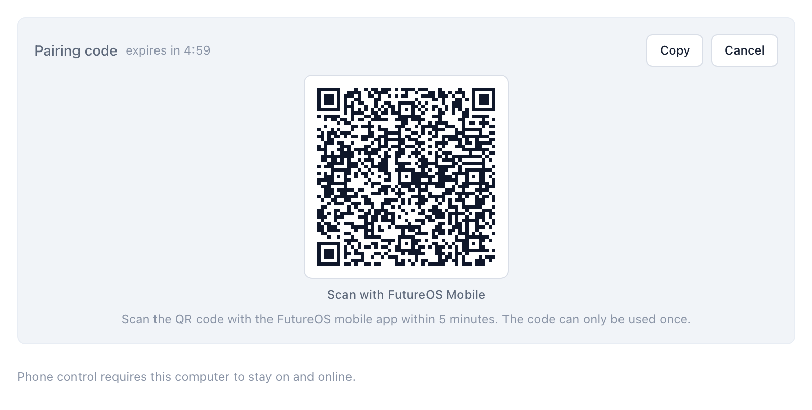
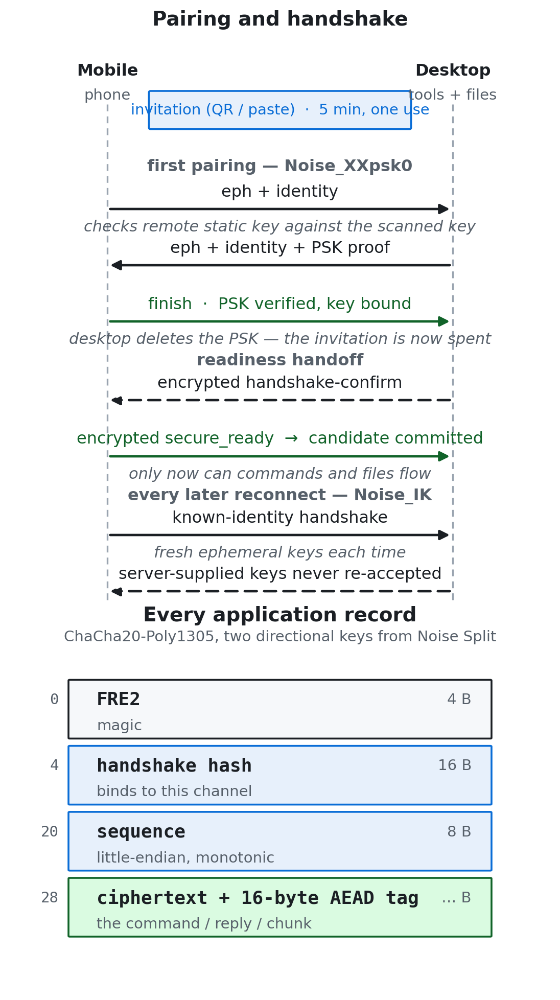

FutureOS Mobile lets your phone drive sessions on your desktop: read streaming replies, send prompts, approve requests, move files. The tools execute on the desktop, not the phone — so commands, conversation events and file content all travel between the two devices over a NATS relay.

That relay is on the public network. The design has to start from an uncomfortable assumption: **the relay is hostile.**

## The threat model

A malicious relay can drop, delay, reorder, replay, reroute and fabricate messages. What it must *not* be able to do is learn application plaintext, or manufacture a command, reply, file chunk or presence event that either endpoint accepts.

So Mobile and Desktop authenticate each other and encrypt every application record *before* publishing to NATS. The relay only ever sees ciphertext and subjects.

What this doesn't protect, stated plainly: a compromised endpoint, a stolen or unlocked credential store, a leaked **unused** invitation, traffic timing and size, NATS subject metadata, or availability. Cloud revocation isn't an instantaneous kill signal if an attacker can suppress delivery — but local disable or unpair is: it invalidates access and clears traffic keys and candidates on the spot. NATS JWT ACLs stay as defense in depth, not proof of message origin. And the transport hop is separate from the end-to-end layer — production Desktop requires verified TLS, Mobile requires WSS.

## Pairing: a short-lived bearer invitation

Pairing is how the two devices learn to trust each other, and it's the only moment a secret crosses in the open.

The desktop generates an X25519 identity and an independent random 32-byte invitation PSK locally. Neither the private key nor the PSK is sent to the platform API; the platform's claim nonce is a separate value, and that one does still go to the platform. The invitation — the same one whether you scan the QR code or paste the text — carries `v=2`, the platform code, the `desktopId`, the NATS `desktopKey`, the X25519 `secureKey`, and the local `secret`.

Treat the whole invitation as a short-lived bearer credential: it's valid for five minutes and usable once. Don't share it or post a screenshot of it.

*Figure 1: the panel the desktop puts up to pair a phone, countdown included. The QR encodes the invitation — single-use, and five minutes by default, which is the TTL this demo capture was taken with. It is not a live code. Once the handshake completes the desktop deletes the PSK and the invitation is spent.*

The phone generates its own X25519 identity and stores the bundle in Expo SecureStore (`WHEN_UNLOCKED_THIS_DEVICE_ONLY`); the desktop stores its pairing identity in an owner-restricted, atomic credential file. Neither is a hardware-keystore guarantee — the boundary is the endpoint, not a chip.

## The handshake: Noise, twice

The first pairing uses `Noise_XXpsk0_25519_ChaChaPoly_BLAKE2b`. The phone checks the remote static key against the QR/pasted key before sending the final handshake message. The desktop verifies possession of the invitation PSK, binds the remote static key, persists the binding — and then **removes the PSK** from the active credential. After that the invitation is rejected even if someone copied it. This is authentication by possession of a trusted invitation, not verification of a human identity.

Every later handshake uses `Noise_IK_25519_ChaChaPoly_BLAKE2b`, and both peers require the bound remote identity. So a lost first-pair confirmation can recover with IK using the same phone identity — without ever accepting a server-supplied replacement key. Every handshake uses fresh ephemeral keys, and traffic keys and counters are never saved.

The handshake stays honest in a few details that are easy to get wrong:

- Raw handshake input is capped (16 KiB raw, 8 KiB per Noise message), pending candidates are bounded and expire after 30 s, and only authenticated Noise output can produce a candidate traffic channel.
- A candidate isn't live the moment it handshakes. The desktop returns an encrypted `handshake-confirm`; only after the phone installs and flushes its subscriptions and sends an encrypted `secure_ready` does the desktop commit that candidate as current. A failed candidate never deactivates the previous channel, a stopped access epoch can't install a late candidate, and an uncommitted candidate can't run ordinary commands or upload chunks.

## The record layer

*Figure 2: top — the pairing and handshake sequence (XXpsk0 for the first pairing, IK for every reconnect, with the candidate-readiness handoff in between); bottom — the binary record every application message is wrapped in.*

Everything after the handshake travels as binary records encrypted with ChaCha20-Poly1305, using the two directional keys from the Noise `Split`. Rust uses `snow` and `chacha20poly1305`; Mobile uses `noise-handshake` (pure-JS sodium backend) for the handshake and `@noble/ciphers` for records. The standalone record layer exists so NATS messages can exceed Noise's 65,535-byte transport limit.

Each record is:

| Offset | Bytes | Field |
|---|---:|---|
| 0 | 4 | ASCII `FRE2` |
| 4 | 16 | first 16 bytes of the Noise handshake hash |
| 20 | 8 | little-endian sequence number |
| 28 | variable | ciphertext + 16-byte AEAD tag |

The nonce is four zero bytes followed by the 8-byte sequence. Each direction has an independent key and monotonic counter, with a mandatory re-handshake before sequence 2³²−1. The wire limit is 1 MiB, leaving 1 MiB − 44 for plaintext; the fixed overhead is 44 bytes, and business and file traffic pay no Base64 expansion. (Handshake fields are small Base64url strings, which is a different path.)

The parts that make it hold up under an adversarial relay:

- **The NATS subject is authenticated as additional data.** Substituting a subject — replaying a record onto a different one — fails authentication.
- **Replies are bound to their request, not the relay's inbox.** The reply context is `reply:<request subject>:<hex of the request's fixed header bytes 4..28>`, so substituting reply inboxes can't substitute responses.
- **A bounded replay window.** Receivers keep a 4096-record window per channel/direction, and authentication succeeds *before* the window mutates. Reflected, wrong-subject, wrong-connection, tampered, duplicate and out-of-window records are all rejected.
- **Authenticate before anything else.** Receive authentication precedes decompression, JSON decoding and business dedup. Compression, when enabled, happens before encryption.

All command/reply, file upload/download, presence, catalog, event and disconnect paths use this boundary. Pairing controls are the only raw exception. NATS subjects stay visible — the protocol doesn't claim metadata confidentiality.

## How it's checked

[`vectors.json`](https://github.com/futuregene/future-os/blob/main/packages/remote-crypto/tests/vectors.json) is verified by both Rust/snow and Mobile against deterministic public test keys, covering XXpsk0, IK, handshake hashes, record bytes, AAD and reply association — so the two independent implementations produce byte-identical output.

The test suite also exercises bytewise tampering, wrong PSK/prologue/key, replay and reflection, large records, lost confirmation, pinned-key reconnect, stale credential refresh, failed persistence, invitation reuse/expiry, the readiness handoff, local invalidation, and an encrypted request through the actual Desktop NATS command loop. The verification pass — Rust clippy with `-D warnings`, 1167 desktop library tests plus its binary and integration groups, 967 desktop Vitest tests, 900 mobile Jest tests — is in the repo's verification snapshot.

One caveat on what that proves. The older business and lifecycle fixtures mock their own authenticated transport, so passing fixtures are not on their own evidence of end-to-end encryption; the crypto vectors and the paths driven through the real command loop are. The in-process Rust test relay also runs in plaintext by design.

What is left unmeasured is the device side. Performance and battery have to be measured on real Android/iOS hardware before any handset-latency claim — what we have are Node and desktop test runs, not device guarantees. And none of this is an independent cryptographic audit or a penetration-test certificate.

## Where this leaves it

The relay doesn't have to be trusted, because it never sees anything it can act on. Pairing is a one-time, five-minute, single-use bearer invitation; identity is bound by a Noise handshake and never re-accepted from the server; every application record is authenticated end to end with the subject and reply context folded in; and recovery paths refuse to trust unsigned discovery.

The protocol and threat boundary are specified in [`REMOTE_E2EE.md`](https://github.com/futuregene/future-os/blob/main/docs/internals/desktop/REMOTE_E2EE.md) in the FutureOS repo; the shared crypto crate is [`remote-crypto`](https://github.com/futuregene/future-os/tree/main/packages/remote-crypto).
