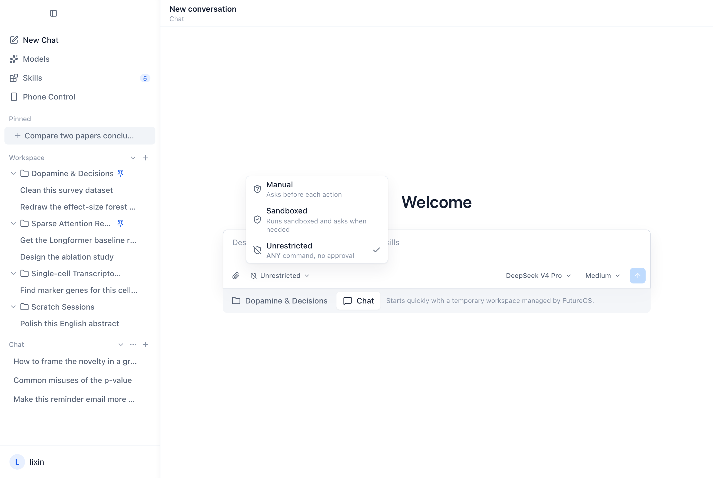

The promise to the user fits in one sentence: when the agent runs a shell command, it should not be able to read or write what you have not allowed. That is one sentence of product. Underneath it sits one of the more humbling pieces of engineering in FutureOS, because there is no such thing as "a sandbox." There are three operating systems, each with its own idea of what confinement even means, and a rule model that has to survive being translated into all three.

This is how we do it, including the parts that do not fully work.



*One setting, three behaviors. The same "Sandboxed" tier means Seatbelt on a Mac, Bubblewrap on Linux, and write-only protection on Windows.*

## One rule model, three backends

Everything starts from a single, platform-independent rule set. A rule is a path, an access (read, write, or both), and an action (allow, ask, or deny):

```json
{
  "version": 1,
  "rules": [
    { "path": "dist", "access": "write", "action": "allow" },
    { "path": "~/notes", "access": "write", "action": "ask" },
    { "path": "private-data", "action": "deny" }
  ]
}
```

Rules live in two files — one in the workspace, one in your home directory — so you can commit project rules to git and keep personal rules to yourself. There is a priority order: built-in guards outrank session grants, which outrank workspace rules, which outrank user rules. A built-in guard list marks the obvious credentials (`.ssh`, `.aws`, `.env`, `.npmrc`, your kubeconfig, and so on) as always-ask for both read and write, and a broad directory allow never lifts a guard.

That model is the easy part. The hard part is that when a command runs, this abstract rule set has to become something the kernel will actually enforce — and the kernel speaks a different language on every OS.

| | macOS | Linux | Windows |
|---|---|---|---|
| Backend | Seatbelt | Bubblewrap | Restricted token + NTFS ACL |
| Shell read protection | SBPL path rules | masked mounts | **not provided** |
| Shell write protection | dynamic SBPL rules | read-only root + writable mounts | capability-SID write boundary |

Read that last row again. It is the single most important line in this post.

## macOS: the one that does what you'd expect

Seatbelt is the closest thing to the sandbox you probably imagine. The rule set compiles down to an SBPL profile — the same sandbox profile language the OS uses for its own daemons — and `sandbox-exec` launches the command inside it. Paths you denied are genuinely unreadable and unwritable, because the kernel rejects the syscall.

The sharp edge is not enforcement, it is escape. Sometimes a legitimate command needs to step outside the sandbox — a build tool writing somewhere unexpected. We handle that with an explicit, one-time escalation: the whole command runs outside the OS sandbox, once, only after you approve it on a card. The global tier does not change. And we are careful about what the card claims: what you approved is "this exact command, outside the sandbox, this once" — not "this path," and not "forever."

## Linux: real confinement, with a compatibility bill

On Linux the backend is [Bubblewrap](https://github.com/containers/bubblewrap). The plan turns the rule set into a mount namespace: a read-only root, the workspace and temp dirs bind-mounted writable, denied paths masked out. It is genuine confinement — user, PID, and IPC namespaces, capabilities dropped, a fresh `/proc`.

The cost is not the sandboxing, it is everything around it. We only support the *system* Bubblewrap — no bundling, no downloading a binary, no silent fallback to Landlock. That means a three-layer availability probe before the option is even selectable: find the binary on a secure PATH, check the version is at least 0.9.0 and that required arguments exist, then actually run a tiny namespace to prove the host allows it. Each failure has a specific code (`binary_missing`, `user_namespace_disabled`, `version_too_old`, …) so the settings page can say *why* and *what to do about it* instead of a useless "unavailable."

There is also a subtle correctness point that took real effort: a mount namespace isolates mounts, not the *contents* of host directories. If a denied path is matched by a glob, we can only protect the paths that existed when the command launched. A file created mid-command that would match the glob is caught only by a post-scan, not prevented. We say so, rather than claiming the glob is a hard boundary.

## Windows: where we tell you the truth

Windows is the honest one, because we cannot give you what the other two give. The approach that needs no admin rights is a restricted token plus NTFS ACLs: we create a token with a capability SID, add deny ACLs for protected paths, and launch the shell with it. It works, and it is genuinely useful — but it is **write protection, not a read sandbox**. A shell on Windows can still read anything your user can read and send it over the network.

We could have pretended otherwise. The settings copy could have said "sandboxed" and left it at that. Instead the tier is named "write protection" on Windows, the docs say plainly that shell read protection is not provided, and the sensitive-guard list is explicitly *not* a read-deny guarantee there. When a user approves something on Windows, the card lists concrete write targets — at most eight, no "and N more" hiding the scope — because a vague approval on a write-only boundary is worse than useless.

This was a deliberate choice. The alternative that *would* give real isolation (an elevated, separate sandbox account) needs provisioning and UAC prompts, and we judged that friction worse than an honest partial protection. We might revisit it. We will not claim it before it exists.

## Where the promise bends

A few gaps we ship with our eyes open, rather than discover in a bug report:

- **Windows has no shell read protection.** Said above, worth repeating.
- **A user-approved whole-command escalation is not bound by OS rules.** Once you approve running outside the sandbox on macOS or Linux, the built-in guards no longer apply to that run.
- **Credentials had to be let through.** `auth.json` was temporarily removed from the hard-deny list because the official CLI's own tests needed it. A default read can expose credentials, and we do not advertise this temporary exception as a security boundary.
- **One canonicalization is not a race-free proof.** A symlink is judged by its final target, but between the check and the use the target can change; Linux and Windows re-check the object at execution time to narrow that window.

None of these are secrets. They are in the docs, in the settings copy, and now here.

## Why not just pick one?

The obvious question: why maintain three mechanisms instead of shipping a bundled sandbox that behaves identically everywhere? Because a bundled, downloaded sandbox binary is its own attack surface and its own support burden, and because the *native* mechanism on each OS is the one that is already maintained, already audited by the platform vendor, and already present. The cost is that our rule model has to degrade gracefully — deny-wins NTFS ACLs cannot express every first-match exception that SBPL can, so the Windows plan explicitly records which rules it could not enforce instead of silently dropping them.

The product goal was never "a fortress against a hostile host." It is simpler and more useful than that: reasonable protection, a smooth development flow, and no lying to the user about which is which. On a Mac you get the real thing. On Linux you get the real thing plus a compatibility bill. On Windows you get honest write protection. The setting looks the same; what it means is not, and we think you deserve to know the difference.

---

*The shared rules and approval protocol are documented in [`SANDBOX/COMMON.md`](https://github.com/futuregene/future-os/blob/main/docs/internals/desktop/SANDBOX/COMMON.md); the per-platform implementations are in [`SANDBOX/`](https://github.com/futuregene/future-os/tree/main/docs/internals/desktop/SANDBOX). The Linux backend merged in [#496](https://github.com/futuregene/future-os/pull/496).*
