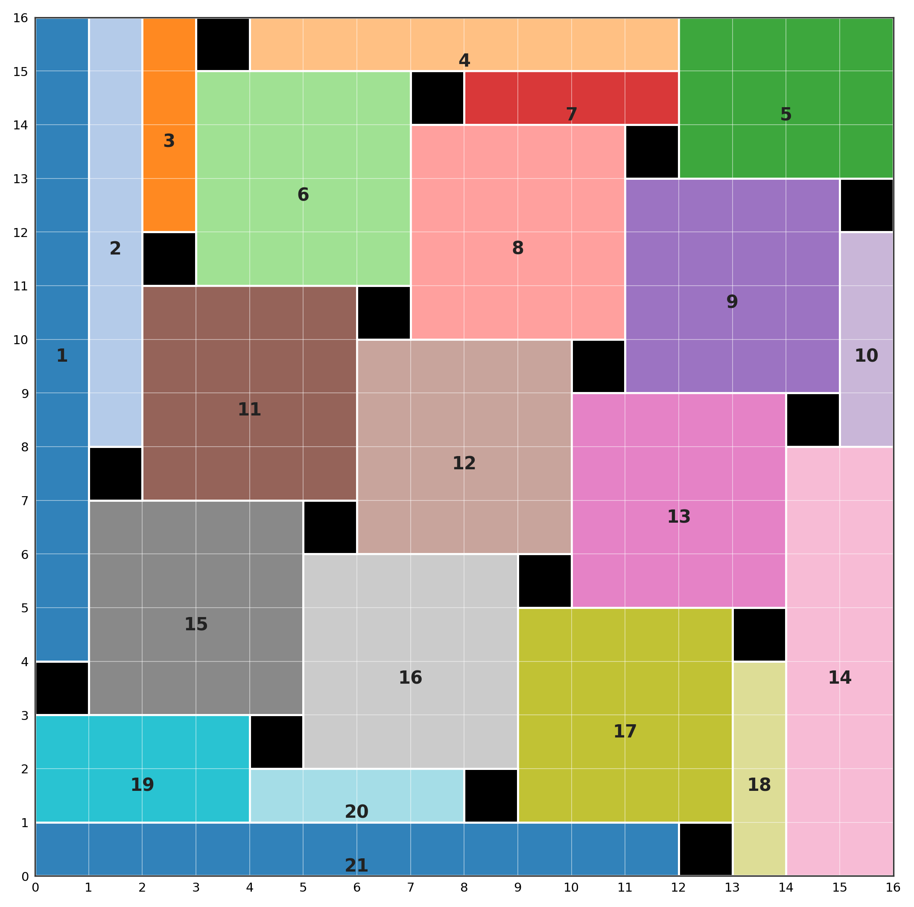

Take a 16×16 grid of unit squares. Place axis-aligned rectangles on it so that
every row and every column has exactly one square left uncovered. What's the
fewest rectangles you need?

This is the kind of problem a single agent tends to get wrong in a confident
way: it finds a construction, convinces itself of a matching lower bound, and
writes up a clean, self-consistent, incorrect answer. We ran it through the
future-loop multi-agent control plane instead — four different models working in
parallel, with an orchestrator that coordinates but is forbidden from solving.
The answer is 21, and the interesting part is how the system got there.

## The orchestrator doesn't solve anything

The whole run is driven by **future-loop**, FutureOS's control plane for
multi-agent work. The user's prompt to the orchestrator ends with a hard
constraint: *do not do any solving in this session*. The orchestrator's job is
limited to decomposing the task, scheduling workers, adjudicating results, and
keeping the evidence ledger. All the mathematics happens in the worker
sessions.

A few mechanisms carry the weight:

- **Goals and work cards.** The task is broken into cards, each with a priority,
  dependencies, and a single owner. One worker per card, so parallel workers
  can't claim each other's work.
- **Verify gates and evidence.** Every deliverable card binds a shell command
  (e.g. `test -s <report path>`) and a non-empty evidence note. When a worker
  claims done, the control plane runs the gate itself; if it fails, the claim
  isn't accepted.
- **A shared board.** Workers can only append short conclusions (3–5 lines) to a
  shared file — the only cross-worker broadcast channel. Each worker also gets
  its own artifact directory, so nobody overwrites anyone else.
- **Steering.** The orchestrator can inject an instruction into a worker at any
  time. We used this once to rescue a worker that had been running for 40
  minutes without writing anything to disk.
- **Fault recovery.** Infrastructure failures (an upstream disconnect, say) are
  marked recoverable: the session is kept, context replayed, the run resumed —
  without spending the run's error budget.

Before any worker started, the orchestrator wrote the shared notation and
collaboration protocol into `PROBLEM.md` — how to denote a hole, the tile
coordinate format, what a verification script must do — so any worker's result
could be re-run by any other. That "protocol first, then work" discipline turned
out to matter.

## The problem

Because each row and column has exactly one uncovered square (a *hole*), the
holes are `U = {(r, π(r))}` for some permutation π of `{1..16}`. A tile is a
rectangle containing no hole. For a fixed π, let `τ(π)` be the fewest tiles that
exactly partition the board minus the holes. The answer is `k* = min over π of
τ(π)`.

Four models worked as workers: `glm-5.3-flash` (audit / counterexamples),
`deepseek-v4-pro` (proofs / constructions), `kimi-k3` (construction search), and
`gpt-5.6-sol` (independent exploration, reflection, final review). They also had
real solvers: Z3, OR-Tools CP-SAT, Kissat, HiGHS, and a hand-written bitmask
DFS for small cases.

## The timeline

The run went 22:05 → 02:34, 269 minutes of wall clock, 15 rounds.

| Stage | Time | What happened |
|---|---|---|
| Parallel explore | 22:05–22:49 | All four workers start. gpt(low) answers k = 30 in 2.1 min with a diagonal construction; deepseek gets k = 23; kimi uses exact small values (n = 4..7 give 5, 7, 8, 10, all below 2n − 2) to **disprove the universal lower bound** and gets k = 22; glm times out with nothing on disk, is steered back, and reproduces k = 30. |
| Cross-reflection | 23:00–23:04 | gpt(high) re-runs all four verifiers and adjudicates: the k = 30 lemma and the k = 23 formula are both killed by the k = 22 counterexample. The state tightens to 15 ≤ k* ≤ 22. |
| Second round | 23:06–23:57 | deepseek finds a 4×4-grid permutation construction with **k = 21** and proposes a lemma; gpt's joint SMT (permutation not fixed) independently finds the same construction mirrored, and proves n=16, k=20 UNSAT (221 s); kimi proves by exact ILP that this permutation needs exactly 21; glm cross-reproduces all the small exact values. |
| Adversarial final check | 00:09–02:19 | kimi: 57,897 exact ILP instances (including a complete 2-swap neighbourhood) hit nothing at k ≤ 20; deepseek formalises the lemma's decomposition and induction; gpt: CP-SAT returns INFEASIBLE twice and CNF/Kissat reproduces the construction a third time; glm audits all 48,232 permutations up to n = 8 with zero violations. |
| Final review | 02:28–02:34 | gpt(high) re-runs the key verifiers and actually re-runs CP-SAT (INFEASIBLE again, 94 s), writes the final report, and the goal closes its verification loop. |

## The answer is 21

The construction uses the permutation `π(r) ≡ 4r (mod 17)`:

```
π = 4, 8, 12, 16, 3, 7, 11, 15, 2, 6, 10, 14, 1, 5, 9, 13
```



*Figure 1: the optimal tiling. Black cells are the 16 holes (one per row and
column); the colored numbered regions are the 21 tiles.*

That gives k* ≤ 21. For the lower bound, a structural lemma ties the tile count
to the permutation's longest increasing and decreasing subsequences (LIS / LDS):
`τ(π) ≥ n + LIS(π) + LDS(π) − 3`. By the Erdős–Szekeres theorem `LIS·LDS ≥ n`,
so for n = 16 you get `LIS + LDS ≥ 8`, and the lemma gives `τ(π) ≥ 16 + 8 − 3 =
21` for every π. The decomposition and induction steps of that lemma are fully
formalised; the base case (a closed-form witness set for simple permutations) is
still open, though it's confirmed computationally for all 48,232 permutations up
to n = 8 and for the specific balanced permutations at n = 16.

The neat part is that the lemma's bookkeeping explains every earlier wrong
answer. The diagonal permutation has `LIS=16, LDS=1`, lower bound `16+16+1−3 =
30` — exactly its construction. The shuffle permutation has `LIS=8, LDS=2`,
bound `16+8+2−3 = 23` — again exact. The only way to do better is to balance the
two, and the 4×4 grid makes `LIS = LDS = 4`, hitting both the Erdős–Szekeres
bound and the lemma's bound at once. Upper and lower bound meet on the same
permutation.

Independently of the math, two exact encodings — Z3 (QF_LIA, cell-coverage
semantics) and OR-Tools CP-SAT (NoOverlap2D + area conservation), with different
front-ends and different solver kernels — both ruled out k = 20 with the
permutation *not* fixed. Since any tiling with fewer than 20 tiles can be
subdivided into exactly 20, ruling out 20 rules out everything up to 20.

## What it cost

| Stage | Model (effort) | Time (min) | Input tok | Output tok | Cost |
|---|---|---:|---:|---:|---:|
| Explore | gpt-5.6-sol (low) | 2.1 | 170,499 | 4,865 | $0.78 † |
| Explore | deepseek-v4-pro (high) | 34.0 | 2,453,301 | 108,580 | ¥1.91 |
| Explore | kimi-k3 (high) | 44.4 | 622,961 | 74,681 | ¥19.93 |
| Explore | glm-5.3-flash (high) * | 48.5 | 135,763 | 43,868 | ¥0.09 |
| Reflect | gpt-5.6-sol (high) | 3.9 | 431,109 | 9,080 | $1.91 † |
| Round 2 | glm-5.3-flash (high) | 27.3 | 438,737 | 60,207 | ¥0.15 |
| Round 2 | deepseek-v4-pro (high) | 43.9 | 3,289,309 | 130,402 | ¥2.38 |
| Round 2 | kimi-k3 (high) | 48.9 | 865,052 | 16,195 | ¥18.92 |
| Round 2 | gpt-5.6-sol (high) | 51.5 | 1,181,143 | 15,773 | $5.04 † |
| Round 3 | kimi-k3 (high) | 27.9 | 985,814 | 14,915 | ¥21.21 |
| Round 3 | deepseek-v4-pro (high) | 35.0 | 3,131,360 | 124,650 | ¥2.36 |
| Round 3 | glm-5.3-flash (high) | 38.8 | 542,528 | 52,202 | ¥0.15 |
| Round 3 | gpt-5.6-sol (high) | 129.6 | 1,955,548 | 30,218 | $8.43 † |
| Final | gpt-5.6-sol (high) | 5.5 | 805,660 | 10,619 | $3.44 † |
| **Total** | 4 models / 15 rounds | 571 serial / 269 parallel | 17,008,784 | 696,255 | ¥67.08 + $19.5–38.5 † |

† gpt-5.6-sol is estimated at its promotional rate; the others are actual billed
cost. * glm's first round timed out with zero output and was steered back.

Three things stand out. The fastest answer was the worst — gpt(low) gave 30 in
2.1 minutes, and the slowest chains were the valuable ones. Most of the wall
clock was solver subprocesses and large enumerations (~2.9 hours), with LLM
inference a small share — which is the shape you want: spend model time on
thinking, wall time on computing. And kimi-k3 carried the heaviest ILP
orchestration (81 % of the domestic-model cost), but the two decisive breaks —
disproving 30, and the final zero-hit verification — were both its.

## Did anyone cheat?

Three layers of audit, all with re-checkable trails:

1. **Tool layer:** across 15 runs the workers only used read / shell / write /
   edit. Web search, fetch, and browser calls: zero.
2. **Parameter layer:** every worker transcript scanned for
   curl/wget/requests/urllib/httpx/socket, search-engine and Q&A keywords, and
   external URLs. The only network activity was in one round-3 session —
   `brew install kissat`, a `git clone` of drat-trim, `pip install ortools` —
   installing local solvers, not looking up answers.
3. **Artifact layer:** every part of the final construction and lower bound
   traces to a worker-generated script and output (verifiers, SMT2/CNF files
   with SHA-256, 57,897 ILP logs).

On "the model might just remember the answer": it can't be ruled out absolutely,
but the four models gave 30, 23, 22, 30 in round one — memorised answers would
converge. Two 21-tile constructions were found independently by two models that
couldn't see each other's directories, as mirror images with full valid tilings.
And the final answer is anchored by exhaustive local computation (UNSAT and
ILP), not by any model's say-so.

## Why multi-agent helped here

The answer went 30 → 22 → 21, and each drop came from a different model
disagreeing with the others, not from any model reasoning harder. A single agent
that settles on "diagonal + 30" with a self-consistent wrong lower bound would
have shipped a wrong answer. What broke it was kimi-k3's small-case
counterexample, then deepseek's permutation balancing for the second break.

The two 21-tile constructions found independently — one by ILP, one by SMT,
under different encodings and solvers, as mirror images, then reproduced a third
time by CNF/Kissat — are the strongest kind of cross-validation. And the
adversarial split meant "find 21" and "prove 21" were attacked along four routes
at once (construction search, mathematical lower bound, computational
exclusion, method audit), each checking the others.

On the engineering side, verify gates turned "claimed done" into "verified
done": 13/15 passed, 1 was blocked by a gate (the work got filled in the next
round), 1 errored into failure and recovered. The final reviewer re-ran things
instead of trusting summaries. And parallelism cut wall clock from 571 to 269
minutes — about 2.1×.

## The honest caveats

An exploratory worker needs a "checkpoint to disk periodically" convention —
glm's first round spun for 39.5 minutes with nothing written. The orchestrator
made two bookkeeping errors (a mis-set card type, a mis-pointed dependency),
both caught and corrected by the mechanism. kimi failed a verify gate in round
two and its result was briefly invisible. There's no cheap second tier to
offload heavy search to. And the n=16 machine-checkable DRAT/LRAT certificate
didn't close — the biggest remaining formalisation gap.

## Where this leaves it

A gated multi-agent orchestration can solve a mid-size combinatorial
optimisation problem end to end: four heterogeneous models took the answer from
30 to a computationally-exhausted 21 in 4.5 hours, auditable and reproducible
throughout. The upper bound is a strictly verified construction; the lower bound
rests on two solvers independently ruling out 20; the lemma's decomposition and
induction are proven. Closing the base case of the structural lemma, or
producing an n=16 DRAT/LRAT certificate, would each turn this into a clean
theorem or a fully formal proof — both are concrete next targets.

The full case study (with the complete tile coordinates, the reproduction
scripts, and the references) is the source for this post; the orchestration
machinery is [future-loop](https://github.com/futuregene/future-os), the
FutureOS loop control plane.
