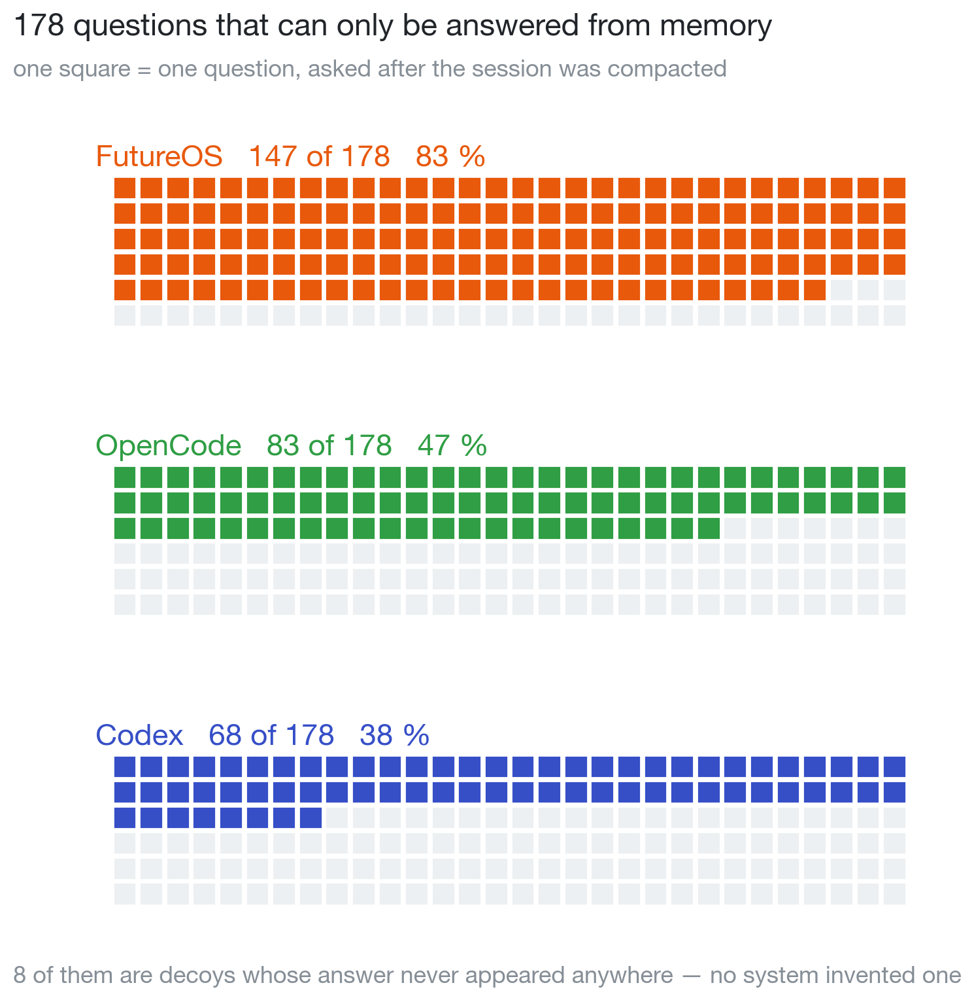
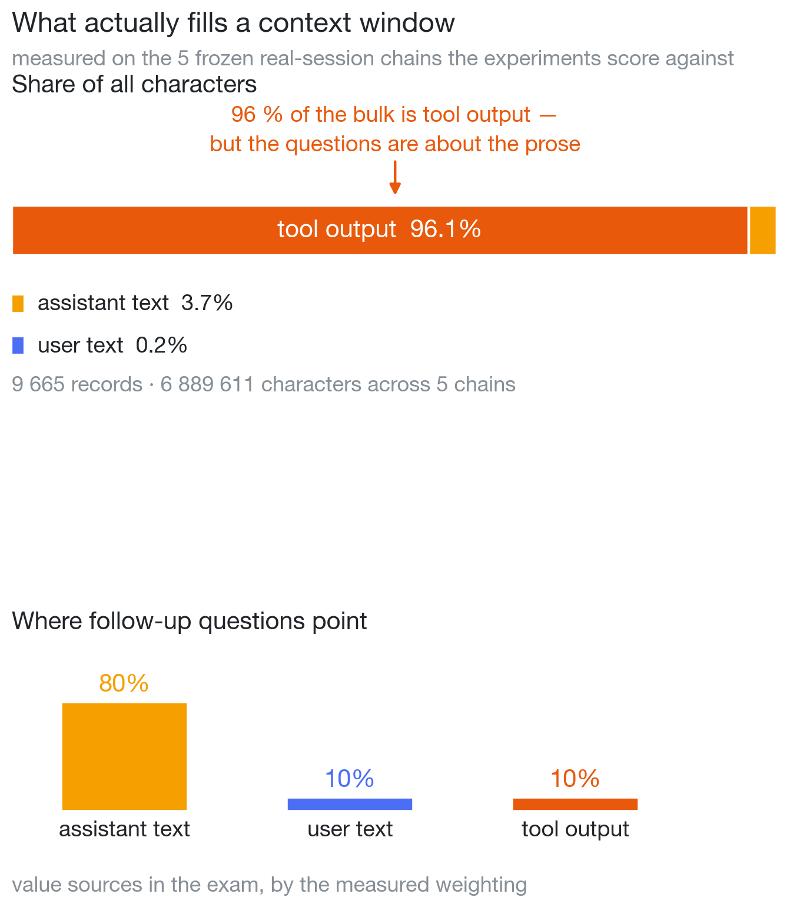
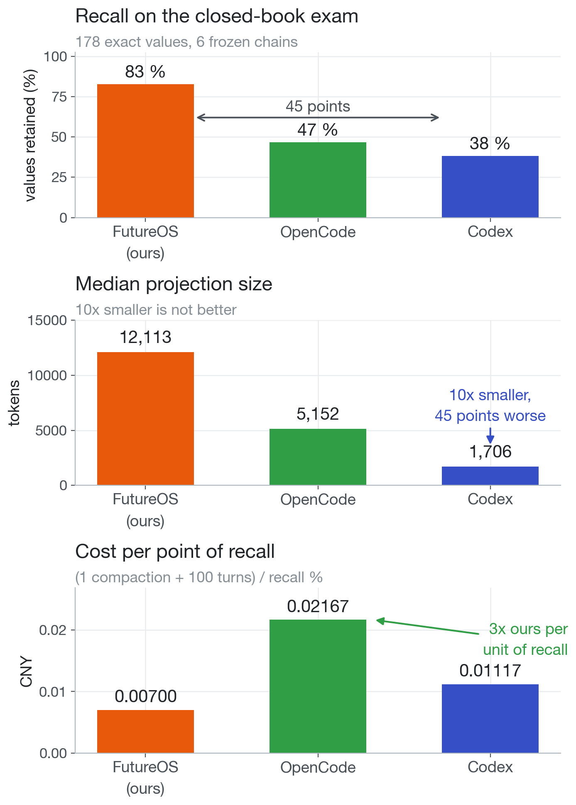
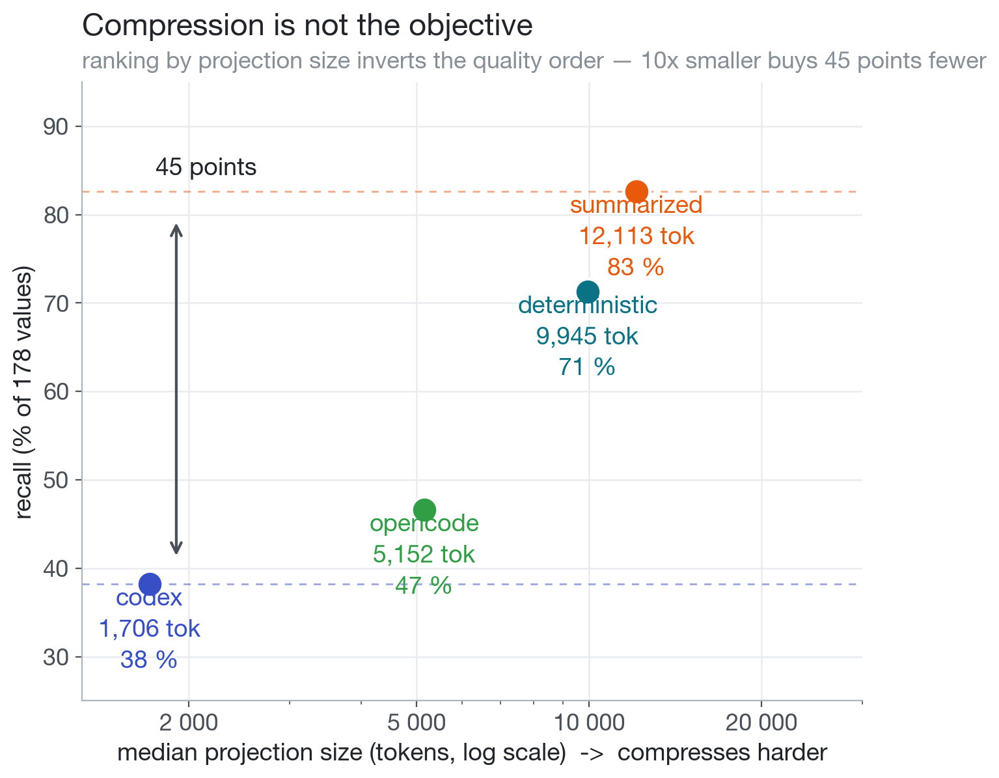
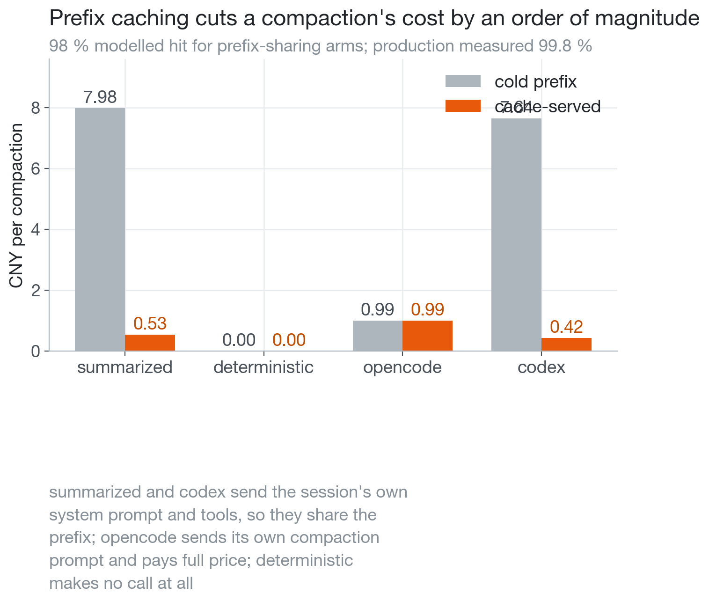
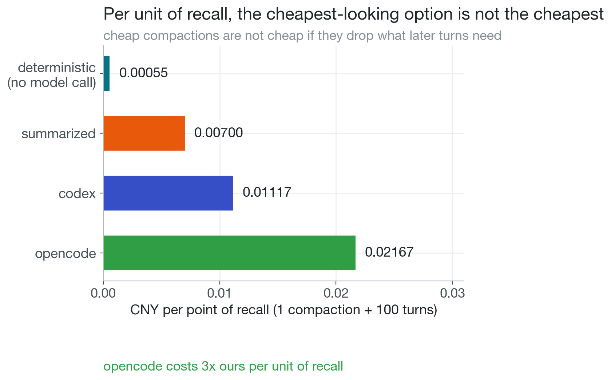
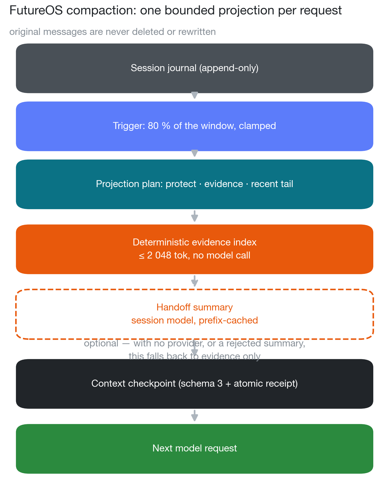
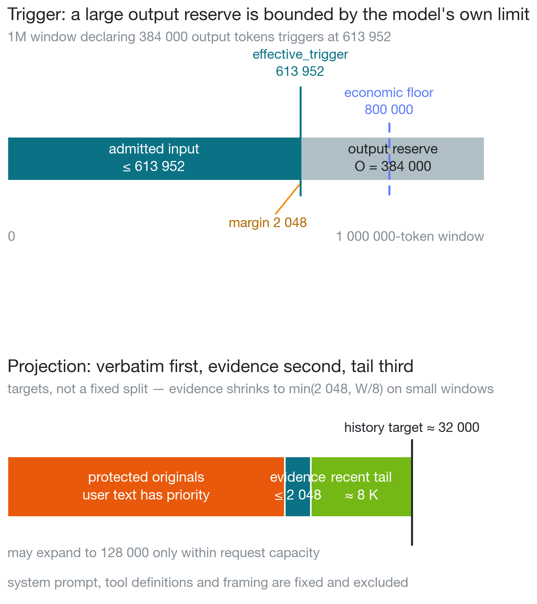
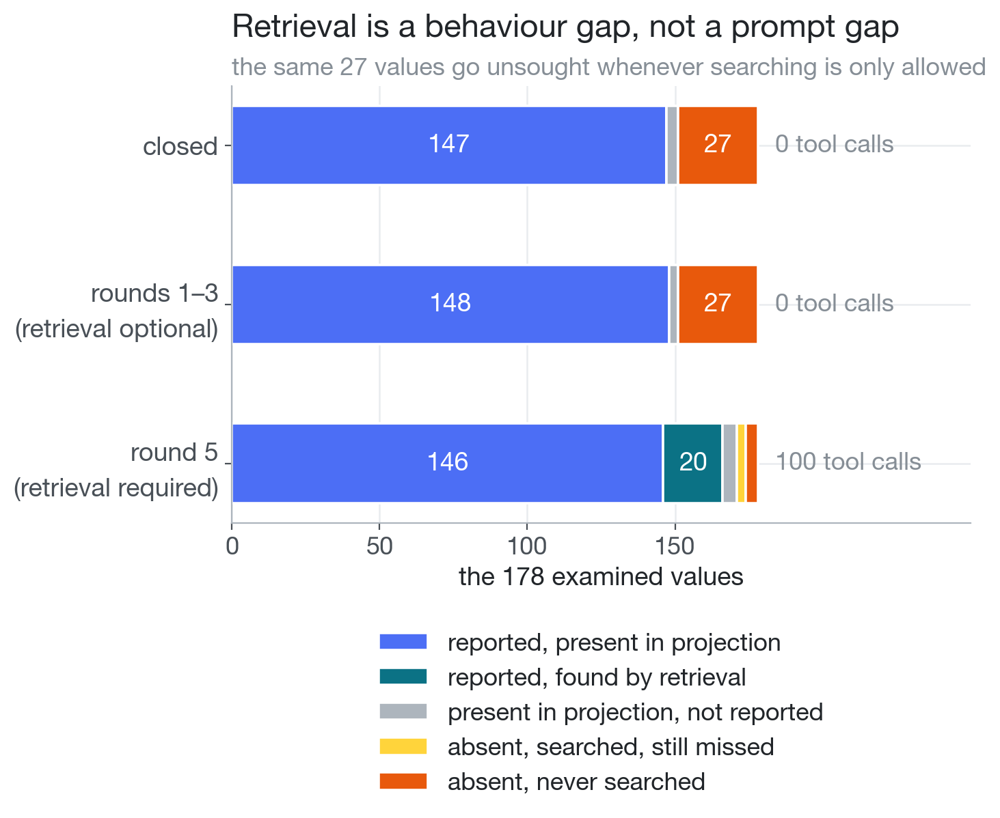

When a long agent session fills the context window, something has to go. The
question every compaction strategy answers differently is the only one that
matters: **what do you keep?**

We put three answers to the test — **FutureOS's default strategy**, **OpenCode**,
and **Codex** — on the same model, with the same questions and the same call
shape. The only variable was what a compaction keeps. Every number below is
reproducible from `scripts/compaction_experiment/` in the FutureOS repository;
the external implementations are pinned to Codex `b13164d8` and OpenCode
`e03db9bc` (package 1.18.31), so a later upstream commit invalidates them.

## The exam

Grow a session until the context is full, **force a compaction**, then ask
**178 questions that can only be answered from memory** — line three of some
script's output, an ID a tool returned, a constraint the user laid down three
hours earlier. Mixed into the set are **8 decoys whose answer never appeared
anywhere**, there to catch a system that guesses.



*Figure 1: the 178 questions, and how many each system could still answer after
compaction.*

**FutureOS retained 147 (83%). OpenCode retained 83 (47%). Codex retained 68
(38%).** Not one of them invented an answer — no system fell for any of the 8
decoys.

The gap is not because one summary was written better than another. It is
because the three systems mean different things by "compact":

| | What it thinks should be kept |
|---|---|
| **Codex** | **What the user said.** All user messages (capped at 20 000 tokens) plus a whole-history summary; assistant prose and tool output are dropped outright. |
| **OpenCode** | **A summary plus a recent tail** (capped at 15 000 tokens). Detail is expected to survive inside the summary. |
| **FutureOS** | **The originals.** Protected user and assistant originals come first; the summary and the tool-evidence index are compensation for what does not fit. |

Leading with a summary has a ceiling: a summary is **lossy and unverifiable**, so
there is no way to tell what it dropped. Codex's choice is more radical still —
it never intended to keep the agent's own output at all.

> **In one line: compaction is not a contest of who squeezes the context
> smallest, but of who knows what to keep.**

## First, what is actually in the context

Compaction is at heart a budget problem, so the first thing to know is what
filled the window. We tallied five frozen real-session chains:



*Figure 2: left — what fills the window; right — where the follow-up questions point.*

| Record type | Records | Share of records | Characters | **Share of characters** |
|---|---:|---:|---:|---:|
| **Tool output** | 4 370 | 45.2 % | 6 622 624 | **96.1 %** |
| Assistant text | 784 | 8.1 % | 256 060 | 3.7 % |
| User text | 141 | 1.5 % | 10 927 | 0.2 % |
| Tool calls (arguments) | 4 370 | 45.2 % | — | — |

9 665 records, 6 889 611 characters. Per chain, tool output is **99.4 % / 98.4 %
/ 96.8 % / 96.7 % / 93.2 %** of the characters — not one chain below 93 %.

**What fills the window is tools, not conversation.** Everything you and the
model said to each other adds up to 3.9 %. But **80 % of follow-up questions
point at what the assistant itself said**, with user turns and tool output at 10
% each:

| | Share of the bulk | Share of the questions |
|---|---:|---:|
| Tool output | **96.1 %** | 10 % |
| Assistant + user text | 3.9 % | **90 %** |

That is the shape a compaction policy should have:

> **Tool output can be compressed hard — down to signposts and nothing more. The
> prose should barely be touched: it is only 3.9 % of the bulk, so compressing it
> saves almost nothing, and yet it is exactly the 90 % the questions point at.**

With that in hand, the losses above make sense: Codex and OpenCode **compress
prose and tools together**. Codex keeps no assistant text at all, voluntarily
giving up 80 % of the questions; OpenCode packs prose into a summary, which is
lossy. Our 83 % against their 38 % / 47 % comes mostly from this one decision.

## What each approach is good at



*Figure 3: left — how much information is retained; middle — how many tokens that
costs; right — the money behind each point of recall.*

| Strategy | Recall | Median projection | Compression | Compaction (cold / cached) | Per turn |
|---|---:|---:|---:|---:|---:|
| **`summarized`** (ours, default) | **147/178 (83 %)** | 12 113 tok | 5.7 % | 7.98 / **0.53** | 0.000480 |
| `deterministic` (ours, no model call) | 127/178 (71 %) | 9 945 tok | 4.7 % | **0 / 0** | 0.000394 |
| **`opencode`** | 83/178 (47 %) | 5 152 tok | 2.1 % | 0.99 / 0.99 | 0.000204 |
| **`codex`** | 68/178 (38 %) | 1 706 tok | 0.6 % | 7.64 / **0.42** | 0.000068 |
| *(no compaction)* | — | 232 777 tok | — | — | 0.009219 |

Costs are CNY; `Per turn` is what re-sending the projection costs on every later
turn.



*Figure 4: x is projection size (log), y is recall. Compression and quality are
negatively correlated here.*

- **Codex wins on thrift.** Smallest projection, cheapest turn, fastest
  break-even (46 turns); its compaction request shares the prefix, so it compacts
  for ¥0.42. It pays in retention scope — no assistant prose, no tool output.
- **OpenCode wins on balance and decoupling.** Summary plus tail keeps a little
  of all three kinds (47 % at 5 152 tokens), and a dedicated compaction system
  prompt decouples the logic from the session prompt. It pays by forfeiting
  prefix sharing (a flat ¥0.99) and by the summary being lossy.
- **FutureOS wins on retention scope.** Originals first earns 83 %, and because
  the summary request reuses the session's own system prompt and tool definitions
  it still hits the prefix cache (99.8 % measured in production), turning ¥7.98
  cold into ¥0.53. The `deterministic` tier makes **no model call at all** —
  exactly 0 cost, 71 % recall. We pay with the largest projection and the most
  expensive turn: we trade tokens for recall.



*Figure 5: compaction cost, cold vs cache-served.*



*Figure 6: one compaction plus 100 turns, per point of recall.*

**The cache cuts the price by an order of magnitude**: ¥7.98 cold against ¥0.53
cached — a 15× drop that flips "8× more expensive than OpenCode" into "half the
price of OpenCode". Per point of recall the arms cost 0.0070 / 0.0112 / 0.0217
(FutureOS / Codex / OpenCode). **A cheap compaction is not cheap if it drops what
later turns need.** And compaction only repays itself over tens of turns (61 for
`summarized`, 46 for `codex`, 110 for `opencode`); for a short session it is a
net cost — what it buys is recall and headroom.

> ⚠️ The cache figures are modelled, not measured: the runs' own cache counters
> are contaminated by arm and run ordering, so the 98 % is anchored to the one
> production measurement (99.8 %).

## How our compaction works



*Figure 7: one complete projection. Original messages are never deleted or
rewritten; compaction only changes what the next request sees.*

The keyword is **projection**: compaction does not delete the journal or rewrite
history. It recomputes, for the next request only, a view of what the model can
see. The originals stay on disk — searchable, exportable, forkable.

**Two algorithms, one fallback.** `algorithm_version` writes exactly two values:
`deterministic-evidence-v1` (protected originals + recent tail + a deterministic
tool-evidence index, no model call) and `summarized-evidence-v1` (the same plus a
handoff summary, one model call). `summarized` is the default; `deterministic` is
also the fallback — with no provider reachable, or when the summary fails, the
deterministic projection is committed.

**The trigger** runs before every model step:

```
economic_trigger  = floor(W × 0.8)                      # 1M window -> 800 000
effective_trigger = min(economic_trigger, W − O − margin)
margin            = min(2048, W / 16)
```

`O` is the model's declared output ceiling; the `min` means a model that reserves
a large output is bounded by its own limit, not a fixed number. And if the input
still fits, nothing is cut.



*Figure 8: top — how the trigger is derived; bottom — the target budgets inside
the projection.*

**What is in the projection.** User text is always kept; the remainder prefers
assistant originals. Tool output is compressed to a **2 048-token evidence
index**, a recent tail of ≈ 8 K tokens is kept, and the history target is about
32 K (up to 128 K, never past real capacity). A demoted assistant output is
labelled "omitted / not summarised" — never dressed up as a summary — and its
original stays queryable.

> **Why does user text win?** User constraints and goals cannot be regenerated;
> tool output and assistant prose can usually be retrieved from the originals. It
> is an information-recoverability argument, not a fairness one.

**The evidence index is fully deterministic** — no model call. Error results
first; then grouped by tool and target, prioritising config / schema / validation
/ test targets; the latest and first of each group; remaining space by recency.
Each selected record becomes one bounded JSON row (entryId, blockIndex,
sourceOrder, tool/target, error flag, head/tail excerpts). A JSON row is never
cut in half, and the index is priority-ordered, not a timeline — `sourceOrder`
keeps the chronology visible so an older error cannot be mistaken for a current
one.

**Why the summary request has no separate prompt.** The provider's prefix cache
compares from token 0: `[system prompt][tool definitions][messages…]`. As long as
those three segments match the conversation that drove the request, the whole
prefix is served from cache — so the summary request carries the session's own
system prompt and tool definitions. Measured on a primed prefix: identical shape
**93.7 %** cache hit; system prompt substituted **0 %**; tool definitions dropped
**0 %**; one line added **0 %**. On the real path, a session grown to 212 911
tokens compacted with `cache_read = 212 548` — 99.8 % from cache, ¥0.003 against
¥0.53 cold. (Cache read is 50× cheaper than fresh input: 0.02 vs 1.0 per 1M
tokens.)

**Checkpoints are idempotent.** A compaction commits atomically with its
completion receipt; a checkpoint written by a retired algorithm is not a
checkpoint at all and gets re-covered once; a same-key success is reused without
another request; an unresolved `started` operation keeps its concurrency fence —
no claim-stealing, no fabricated success.

## Can retrieval recover the loss?

If the originals are all still there, why not let the model look things up? We
ran the open-book exam: one arm, `summarized`, 18 cases, 178 values.

| # | What changed | Design | Recall | Tool calls |
|---|---|---|---:|---:|
| — | *(closed baseline)* | no tools | 147/178 (82.6 %) | 0 |
| 1 | production prompt + tools | autonomous | 148/178 (83.1 %) | **0** |
| 2 | + stronger recall guidance | autonomous | 149/178 (83.7 %) | **0** |
| 3 | + wording that stops calling the projection "the record" | autonomous | 145/178 (81.5 %) | **0** |
| 4 | closed re-scored under round 3's wording (control) | no tools | 147/178 (82.6 %) | 0 |
| 5 | + explicit verification instruction, first call forced | required | **166/178 (93.3 %)** | **100** |



*Figure 9: where the 178 values went. The orange 27 is constant across every
round where searching is only allowed — the model simply never looked.*

Rounds 1–3 are the same result three times: tool calls are zero, and the 145–149
spread is one-flip noise on 178 values. Round 4 is the control for round 3 — if
the wording change moved the score, the closed arm would move with it; it did not
(147 both ways). The **27 is constant**: those values are in the archive and the
model never looked. The required round recovered 20 of the 28 absent ones by
searching — so the gap is **behavioural, not capability**. Round 5 is an upper
bound, not a result: no such instruction exists in production.

Conclusion: the recall guidance was removed from the runtime, while the retrieval
CLI (`future session history search` / `get`) was retained. The guidance
described a capability the model already had, and describing it more firmly is
not what makes a model use it — three variants, 54 cases, zero changed behaviour.
A useful side effect: a session's system prompt no longer changes when a
checkpoint is committed.

**What this means for us**: retrieval cannot close a retention-scope gap. Our
route keeps the originals inside the projection itself, rather than hoping the
model will go looking.

## Limits

- **The exam is recognition, not task continuation.** It asks for exact values —
  what verbatim retention is best at and a summary worst at. A task-shaped exam
  could behave differently.
- **Codex and OpenCode are single-point reimplementations.** Their rules and
  prompts were read from specific commits; a later upstream change invalidates
  the numbers. Codex's first-party retrieval tools need its hosted backend, so
  its column is its local fallback.
- **Synthetic fixtures are tool-heavy**, which rewards carrying tool evidence.
  The real sessions are where the strategies separate.
- **One draw per cell.** Differences of a few points are not resolvable at this
  sample size.
- **The cache figures are modelled**, anchored to one production measurement.

## Reproducing

```sh
# the composition tally (no model, no money)
python3 scripts/compaction_experiment/context_composition.py

# build the drivers
cargo build -p future-agent --example compaction_probe --example model_bridge

# capture the call shape from a real turn (isolated HOME, fresh port)
python3 scripts/compaction_experiment/capture_shape.py \
    --binary target/debug/future --out ~/compact-exp/shape

python3 scripts/compaction_experiment/run_closed_book.py \
    --output ~/compact-exp/v4-forced --force-compaction --budget 300 \
    --driver target/debug/examples/compaction_probe \
    --bridge target/debug/examples/model_bridge --shape ~/compact-exp/shape
```

Inputs, ledgers and results live outside any repository (they include real
session data). The synthetic chains can be regenerated byte-identically from
seeded generators; the real-session chains cannot be published at all, so
third-party reproduction of that half means substituting your own sessions — the
absolute numbers will differ while the comparisons should hold. Before quoting
any number, run `verify_request_shape.py`: it needs no model and checks that the
exam is still sending production's prompt and tools.

The full method, the runtime policy and both experiment reports are in the
[FutureOS repository](https://github.com/futuregene/future-os) under
`docs/internals/compaction/`; the figures are generated by
`scripts/compaction_experiment/sharing_figures.py`.
