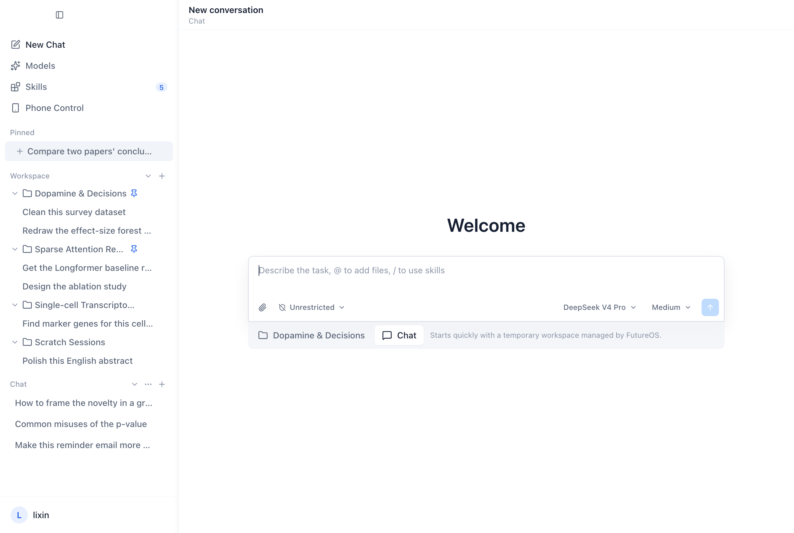

Here is a constraint that sounds like it should make screenshots impossible: the machine producing them has no display, no one is logged in, and the app is not actually running. Yet every product image in our docs — and every figure in the engineering blog you're reading — is a real render of the real interface. Not a mockup drawn in a design tool. Not a screenshot someone took on their laptop and committed by hand. The actual React UI, rendered by an actual browser, on demand.

The trick is that "the app is not running" only means the *backend* isn't. The frontend — the part a screenshot is *of* — is just a web page. And a web page can be rendered by a browser that has no screen.

*This very image was produced by the harness it describes. The interface is real; the machine that rendered it had no display.*

## The three ingredients

The harness lives in [`scripts/screenshots/`](https://github.com/futuregene/future-os/tree/main/scripts/screenshots) and needs exactly three things.

**A scenario file.** A capture is a small JSON script: navigate here, wait, tap this, scroll, take the shot. Steps are intentionally dumb — `tap` a visible label, `scroll` by a delta, `eval` a snippet, `shot` to a path. A scenario for the settings dialog is five steps. Dumb steps are a feature: they make a capture reproducible and a failure legible.

**A mock backend.** The desktop UI talks to a Tauri backend; the harness swaps that for an in-page mock that returns canned data — sessions, threads, settings, sandbox availability. This is what lets the UI render real, populated screens with no agent, no database, and no network. It is also what lets us inject states that are painful to reproduce live: a pending approval, a sandbox that is unavailable, a pairing code. The mock is the only part that has to know anything about the product.

**Headless Chrome, driven over CDP.** The harness either attaches to a Chrome you already have listening on a debug port, or — the common case — launches its own headless Chrome with a throwaway profile. Owning the browser is what makes the whole thing work on a CI runner or a headless Mac mini. It then drives the page over the [Chrome DevTools Protocol](https://chromedevtools.github.io/devtools-protocol/): real input events for taps, real scrolling, and `Page.captureScreenshot` for the image.

That is the whole design. `serve-desktop` starts a Vite dev server pointed at the harness config (plus a stand-in terminal server); `capture-desktop` walks the scenarios, runs the steps, and writes PNGs. Videos are the same thing with frames encoded to MP4.

## Why the real UI and not a mockup

It would be easier to maintain a Figma file. We deliberately don't, for one reason: a mockup lies the moment the UI changes, and it lies silently. A screenshot rendered from the real interface cannot drift from the interface, because it *is* the interface. When someone renames a setting or moves a button, the scenario either still works — and produces an updated image — or fails loudly because a `tap` can no longer find its target. Both outcomes are useful. A stale mockup produces a third, worse outcome: a confident, wrong picture.

This is also why the harness doubles as a lightweight UI regression tool. The steps assert, implicitly, that the elements they touch exist and are reachable. It is not a replacement for real tests, but as a tripwire for "the settings dialog no longer opens" it has earned its keep more than once.

## The parts that were actually hard

The design is simple; the details were not.

**State that lives in the browser.** The UI reads its language from `localStorage` *at module load time*, before any scenario step runs. So "render this in English" is not a step — it is a two-phase dance: set the key, reload, and only then interact. Get the order wrong and you capture a perfectly good screenshot of the wrong language.

**Taps that miss.** Driving by visible text is robust to layout changes but blind to duplicates, and mobile emulation shifts coordinates. We learned to verify a capture by *measuring* the result over CDP — did the dialog actually open, is the toggle actually where we think — rather than trusting that a step ran without error. A step that "could not reach its target" is a signal; a step that silently hit the wrong element is a landmine.

**A browser that won't come back.** On macOS, a headless Chrome that has been killed sometimes refuses to restart on the same debug port. The fix is boring and worth writing down: use a fresh port and a fresh profile directory rather than fighting the zombie.

**Keeping the demo data clean.** To capture an English screenshot of an app whose demo data is Chinese, we temporarily translate the mock, capture, and restore it. The mock is a shared fixture; a capture that leaves it modified pollutes every later run. "Restore what you touched" is a rule the harness cannot enforce, so it has to be a habit.

## What it's for

The obvious use is docs and marketing images that never go stale. The less obvious one is the one this post depends on: illustrated engineering writing. When we wrote about pairing a phone to a desktop over an encrypted channel, the figure of the pairing QR code was not a stock image — it was the real desktop app, rendered by this harness, with the mock persuaded to return a valid pairing invite. The figure is evidence, not decoration.

That, in the end, is the point. Screenshots in a technical post should show the thing as it actually is. If producing them requires a display and a human and a steady hand, they will be produced rarely and go stale quietly. If producing them is a script, they get regenerated every time the UI changes — and the pictures stay as honest as the code.

---

*The harness is [`scripts/screenshots/`](https://github.com/futuregene/future-os/tree/main/scripts/screenshots) — `capture.py` drives the browser and servers, `cdp.mjs` speaks the DevTools Protocol, and `scenarios.json` holds the capture scripts. Captures are gitignored; they are build artifacts, regenerated, never committed.*
