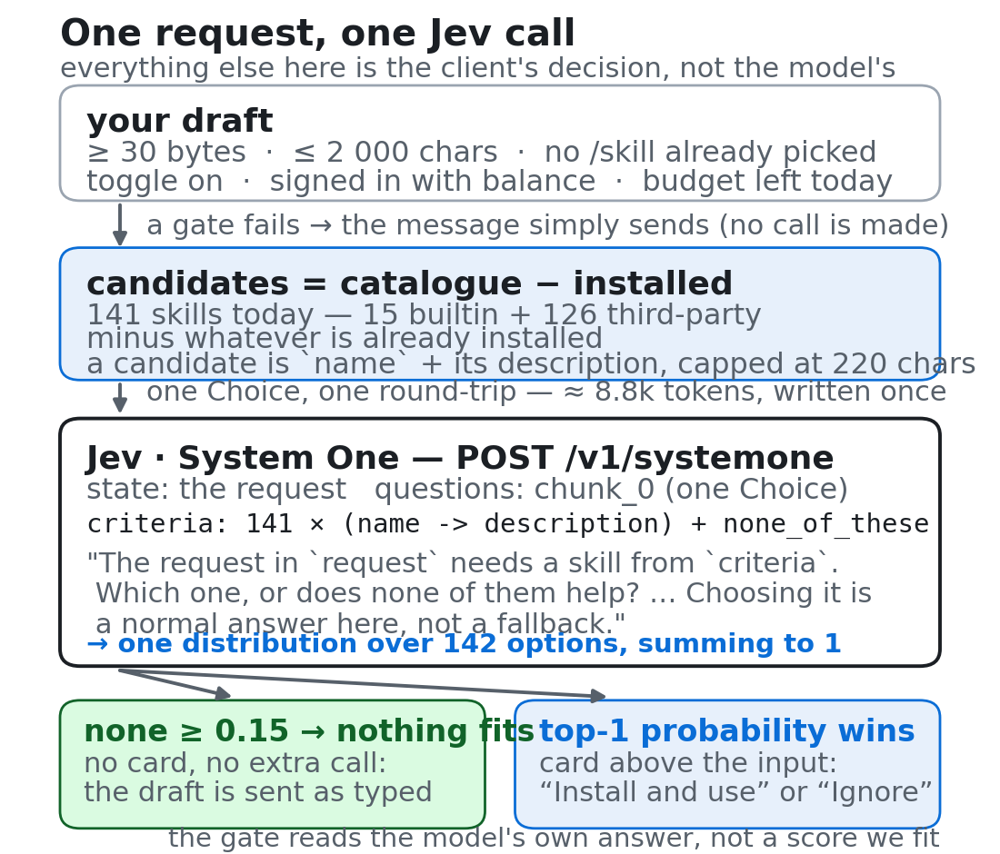
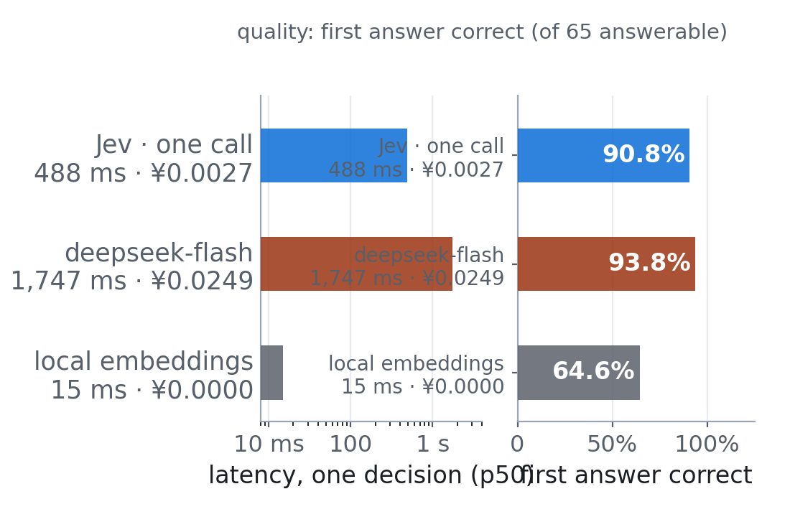
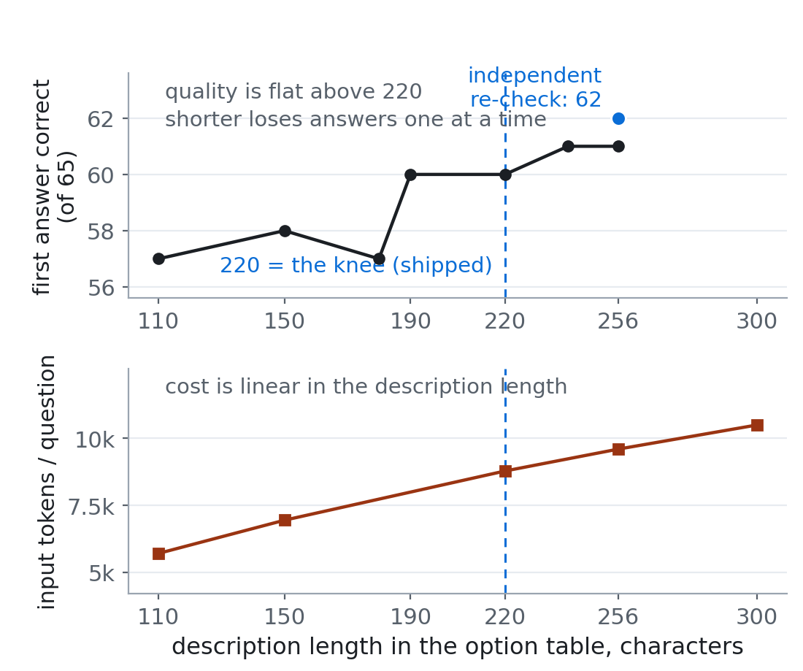

FutureOS ships 141 skills; nobody remembers 141 slash commands. So the agent now offers one skill above the composer when a draft clearly needs one — picked by Jev, TypeSafe's System One model, which judges the content you hand it instead of writing text. One call, one option list, one threshold. We measured it against a strong generative model answering the same question with the same catalogue:

- **accuracy**: 90.8% first-answer correct vs 93.8% — three points behind, inside run-to-run noise (the same code spans 90.8–93.8% between identical runs);
- **cost**: ¥0.0027 vs ¥0.0249 per question — **9× cheaper**;
- **latency**: 0.49 s vs 1.75 s median — **3.6× faster**;
- **refusal**: 97.1% correct on both sides, but Jev's is a probability you threshold; a generative model's is prompt behaviour you cannot adjust.

| system | first answer correct | correct refusal | ¥ / question | latency p50 |
|---|---|---|---|---|
| **Jev, one call (shipped)** | 90.8% | 97.1% | **0.0027** | **488 ms** |
| deepseek-flash, same prompt | 93.8% | 97.1% | 0.0249 | 1,747 ms |
| local embedding retrieval | 64.6% | 71.4% | local compute | 15 ms |

That is the trade: slightly behind a generative model on raw accuracy, an order of magnitude cheaper, several times faster, with a refusal you can audit.

## What we took away

Two conclusions generalise past this feature.

- **A judge model is a good fit for routing.** Picking one of N options — or deciding that none applies — is exactly what Jev is built for. It pays only for the option text it is given, and it answers with probabilities, so refusal becomes a threshold you can log, adjust and recalibrate instead of prompt behaviour you can only re-ask as a whole.
- **A Choice whose caller needs to refuse must carry a none option, and its option list must be complete and exclusive.** The caller sees only the probabilities on that list, so every outcome it acts on needs its own option, no two options may overlap, and the escape is one of them. Without a none option the model still answers — it just has to name a winner, which is how the first version ended up refusing 8 questions it should have answered.

The rest of this post is the 100-question evaluation behind those numbers: what we measured, why the pipeline is one call and not two, and the experiments that failed.

## Noul or Choice

Jev answers typed questions about a `state` in one round-trip ([`jev.mjs`](https://github.com/futuregene/future-os/blob/main/scripts/skill_reco/jev.mjs)). Two of the three types matter here:

- **A noul is a yes/no question, answered as a probability.** Nouls are independent of each other — ask 141 of them in one call and their probabilities sum to whatever they sum to (1.78 on average here). You can rank by them, but there is no built-in notion of "the one best".
- **A Choice is a distribution over the options you supply, always summing to 1.** It always has a winner, even when every option is unsuitable — and it will never say "none of these fit" unless you give it that option.

That shapes the whole design. Refusal is the caller's job, so the request is one Choice over the uninstalled skills plus one extra option, `none_of_these`; the decision reads exactly one number, the probability on none, and 0.15 is the gate. The 141-noul version ranked just as well but cost 2.4× the tokens (21.4k vs 8.8k), because it repeats the question template once per skill instead of writing the option table once.

One structural rule came out of this: a Choice's caller only ever sees the probabilities on the option list, so **the list must be complete and exclusive** — an option for every outcome the caller acts on, no overlap, and the escape is one of them. (A Choice caps at 255 options, none counts as one, 256 comes back a 400 — [`option-limit.mjs`](https://github.com/futuregene/future-os/blob/main/scripts/skill_reco/bench/option-limit.mjs). Above 254 skills, chunk.)

*The shipped path. The model answers one Choice; every other decision on this page is the client's.*

The call is one agent RPC, `suggest_skill` ([`mod.rs`](https://github.com/futuregene/future-os/blob/main/agent/src/skill_reco/mod.rs)); desktop, TUI and mobile own the trigger rules and each keeps its own daily budget of three cards.

## Why one call and not two

The natural instinct is a second call to double-check: route first, then re-ask the top candidates with more context. We built that, and it does score higher — **95.4% against 90.8%**, because the second call can read the skill's documentation, which the option table does not carry. But the numbers behind it:

- it merely **confirmed the first call on 95% of the questions** it was reached on — the corrections were 3 of 65;
- its own fit threshold **never fired once** in 100 questions — refusal was entirely the gate's job anyway;
- it cost **one more network round-trip per request** (p50 488 → 772 ms) and +10% cost;
- and two of its three wins came from question wording that overlaps the skill's *documentation*, which only the second call could read — an upper bound on the real gain, not the expected value.

Three more questions for one more round-trip on every request, one more failure mode, and a bias inflating the gain. That is why the serving path is one call.

## What the evaluation measured

65 questions a skill should serve (generated from each skill's own SKILL.md, machine-checked to name no skill) plus 35 none should. Reference answers from a strong generative model that never saw which skill a question came from; only the first answer is scored.

- **Jev does not beat the generative model, and cannot be resolved at this size.** Three runs of the *same* Jev code span 90.8–93.8%; the 95.0% vs 93.0% decision-agreement gap is inside that noise. What Jev adds is a refusal you can threshold, log and recalibrate.
- **Embeddings cannot refuse.** Cosine always has a nearest neighbour; a fitted threshold gives 71.4% correct refusal and 16.9% false refusals. Good for instant recall, not for the decision.
- **Cost is the option table.** One more character of description is one more character for each of 141 skills: ¥266/day versus ¥2,490/day at 100k recommendations.

*Same 100 questions, same prompt and the same list for the generative model. The embedding row cannot refuse at all; a generative model's refusal is prompt behaviour, and only Jev's is a threshold.*

## The prompt is at a local optimum

14 variants, four batches, compared **inside one request** as separate Choice questions over the same `state`, because the same code moves on ~9% of questions between runs and would otherwise make every wording experiment look like progress. Nothing beat the shipped wording. Two sentences are load-bearing: dropping "Choosing it is a normal answer here, not a fallback." leaves accuracy unchanged but collapses refusal from 97.1% to 85.7% — the model needs explicit permission to decline — and removing the question's "needs a skill" presupposition costs two refusals.

*Quality is flat from 220 characters up; cost keeps rising. 220 is the knee.*

One more negative result. Two extra options looked natural — "more than one fits" and "the skill I need is not in this list" ([`escape-options.mjs`](https://github.com/futuregene/future-os/blob/main/scripts/skill_reco/bench/escape-options.mjs)). The first was never selected once in 100 questions and fixed nothing (the multi-skill reference set was already hit 12/12). The second was used accurately but only on questions the gate already refused; its one net effect was to take probability mass from none and push through one wrong suggestion. **The gate reads none's share of a distribution that sums to 1, so adding an option silently recalibrates the only refusal signal you have.**

## In the app

The card holds the draft while you decide: *Install and use* appends the slash command, *Ignore and send* sends what you typed — and sending with the card up does the same without another call. The client's deadline is 3 s, up from 1.5, because Jev's p95 is about 1.4 s and a discarded answer looks exactly like "no skill fits". The daily budget counts cards shown, not calls. And one bug worth recording: in the TUI the candidate set only loaded when the `/skills` panel opened, so a fresh session silently refused every message — "wired up" and "works" are different claims, and it now prefetches while you type.

The full evaluation, the 100 questions and a script for every number here are in [`skill_reco/`](https://github.com/futuregene/future-os/tree/main/scripts/skill_reco) — including the failed experiments, which are the ones you would otherwise run twice.
