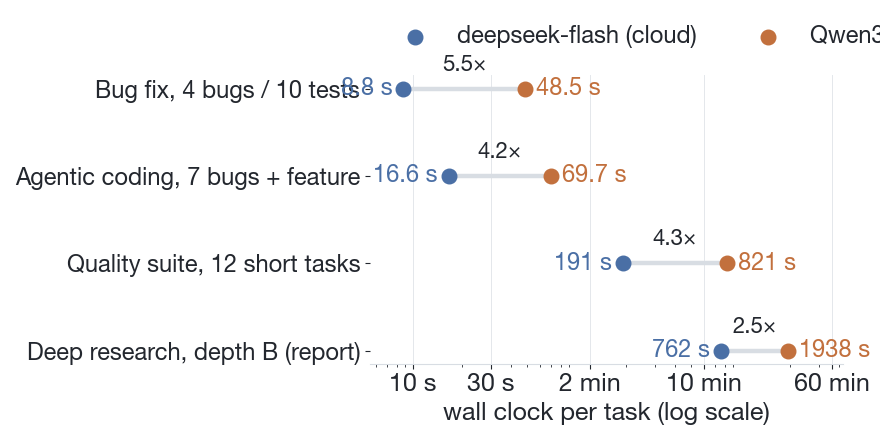
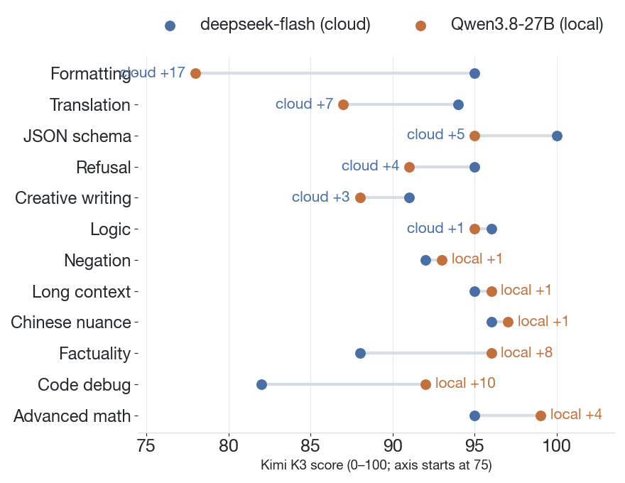
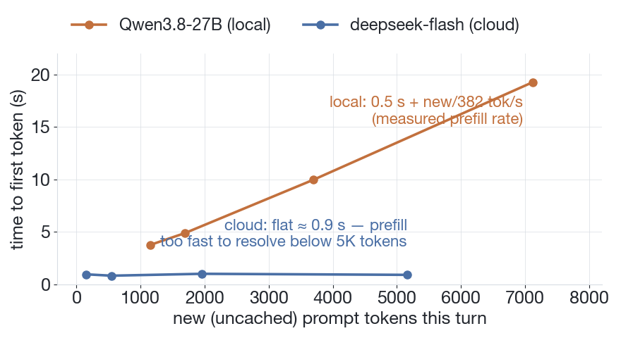

Running a model on your own machine used to be a privacy story with a quality tax. On this generation that trade has narrowed to where we can state it plainly: **for daily work, the local model is good enough.** We measured it — 25 paired tasks across four workloads, same prompts, one strong independent judge — and that is the top line:

- **quality**: 89.5 vs 92.6 on a 100-point scale (local vs cloud), with the 12-item suite splitting six wins each;
- **completion**: every coding run finished green on both models — 10/10 agentic runs fully green (20/20 visible tests, 4/4 hidden checks, tests untouched), and the bug-fix loop fixed all 4 bugs identically in 5/5 rounds each;
- **speed**: 2.5–5.5× the wall clock, depending on the workload, with 95%+ of the local time going to model generation;
- **cost**: the local runs cost nothing beyond electricity. The cloud side of the 12-task suite cost 0.14 credits.

Not equal. Three points behind — and the three points are not spread everywhere; they concentrate. But "behind" is the wrong frame for a decision you actually make every day: can this machine take the work? For the workloads we run, yes.

## What we compared

Two models answering through the same agent, one flag apart:

- **cloud**: `deepseek-flash`, the model our agent runs on by default;
- **local**: Qwen3.8-27B, 4-bit (oQ4e) with MTP enabled, served on a Mac Studio (M3 Ultra, 96 GB unified memory) through the `omlx` provider.

The four workloads:

| workload | shape | reps |
|---|---|---|
| quality suite | 12 short tasks: formatting, JSON, logic, math, code debugging, long-context retrieval, factuality, translation, negation constraint, Chinese nuance, creative writing, safety | 12 tasks × 2 models |
| bug-fix loop | small project, 4 planted bugs, 10 tests; run tests → locate → fix → re-run | 5 rounds × 2 |
| agentic coding | 4 modules, 7 interacting bugs + 1 unimplemented feature; 20 visible tests (18 failing), 4 hidden semantic checks; must iterate | 5 rounds × 2 |
| deep research | depth-B research contract: 20–40 deduplicated sources, ≥40% academic, verified claims, full report | 3 rounds × 2 |

Rules that applied everywhere: identical prompts per pair, identical thinking level, wall clock measured end to end (long runs from the agent's own run records, not from when the CLI returned), and quality scored blind by **Kimi K3** — a model stronger than both contestants — on a 100-point scale, with pairs anonymized and the two orders alternated.

## Wall clock: 2.5–5.5×

*Wall clock per task, log scale. Same prompts, same tools; the local side's extra time is almost entirely model generation.*

| workload | cloud | local | ratio |
|---|---|---|---|
| quality suite (12 tasks, total) | 191 s | 821 s | 4.3× |
| bug-fix loop (mean of 5) | 8.8 s | 48.5 s | 5.5× |
| agentic coding (mean of 5) | 16.6 s | 69.7 s | 4.2× |
| deep research, depth B (mean of 3) | 12.7 min | 32.3 min | 2.5× |

The ratio is not a constant — it is composition. Decompose each run into model time and tool time and the picture is consistent:

- in the small coding scenarios, tool calls are near-instant file reads and test runs; the wall clock is ~95%+ model generation on both sides, so the ratio approaches the pure generation ratio (≈5×);
- in research, the cloud model spent *more* time on tools than the local one (it fetched more sources — and its report is the better one for it), which dilutes the end-to-end ratio to 2.5×. The tool time is shared between the two sides; only the generation time differs.

One more practical number hides in the research runs: the local model took 65 turns to produce its report where the cloud model took 41. More turns at slower speed compound in the same direction.

## Quality: three points, split six–six

*K3 scores per task, axis starts at 75. The 12 items split six–six; local's wins cluster in reasoning and grounding, cloud's in instruction-following and polish.*

| category | cloud | local | gap |
|---|---|---|---|
| 12-task suite (mean) | 93.2 | 92.2 | +1.0 |
| deep research reports (mean of 3) | 91.7 | 87.3 | +4.4 |
| agentic code quality | 93 | 89 | +4 |
| **composite (equal weight)** | **92.6** | **89.5** | **+3.1** |

The composite hides an interesting split. On the 12 short tasks the two models traded wins item for item — six each. The largest gaps in each direction: cloud +17 on strict formatting, local +10 on code debugging; the local wins cluster in reasoning and factual grounding (math +4, factuality +8), the cloud wins in instruction-following and polish (translation +7, JSON +5, refusal +4). Two examples of how differently they fail:

- local, formatting: score 78 — it prefixed the answer with two blank lines, against an explicit "no blank lines" instruction. The content was perfect.
- cloud, factuality: score 88 — asked to recommend books, it listed an Asimov novel under a title that does not exist (《碎石星空》 for 《繁星若尘》, *The Stars, Like Dust*). It invented nothing; it misremembered one name.

The judge found real defects on both sides that our own first-pass review had missed, which is the point of using a model stronger than both contestants. We recommend the same discipline in any private benchmark: judge with something better than what you are testing.

## Coding: everything green, both sides

This is the workload where "daily use" actually gets decided, so we made it hard to pass by accident:

- 7 bugs with *interactions* across 4 modules — fixing one in isolation breaks a visible test; the pass condition is 20/20 visible tests;
- 4 hidden semantic checks (strict boundary, case normalization, default argument, middle-deletion) so a fix that overfits the visible tests fails;
- the test files must be untouched — checked mechanically.

Results, 5 rounds each:

| metric | cloud | local |
|---|---|---|
| visible tests 20/20 | 5/5 rounds | 5/5 rounds |
| hidden checks 4/4 | 5/5 rounds | 5/5 rounds |
| test files unmodified | 5/5 rounds | 5/5 rounds |
| turns / tool calls (mean) | 7.8 / 18.4 | 6.6 / 15.2 |

Both models converged on the same workflow — discover, run tests, read all sources and tests, batch-fix, re-run, iterate — and both fixed all 7 bugs and implemented the feature. In the small bug-fix loop both models produced *identical* four-bug fixes across all 5 rounds, consistent instructions followed consistently.

The blind code-quality score puts the cloud model 4 points ahead (93 vs 89): more uniform empty-input handling and less duplicated logic in the local version. That is a maintainability margin, not a correctness gap — nothing failed on either side.

## Research: delivered 3/3, contract 2/3

The deep-research contract demanded 20–40 deduplicated sources with ≥40% academic, claims verified against their sources, and a full report. All six runs (3 per model) delivered a report; both models respected the honesty rules — no paywall circumvention, failed citations disclosed, conflicting numbers reported side by side instead of averaged.

What separates them:

- **breadth**: cloud reports cite 38–40 sources at 53–67% academic; local reports cite 23–37 at 24–52%;
- **contract compliance**: cloud 3/3, local 2/3 — the miss was a report that came in at 24% academic share, *and said so itself* rather than padding with blogs;
- **one real defect**: a local report referenced sources N13–N22 in its body that are missing from its reference list — a broken citation chain, the kind of thing that would need a human check before publishing. Cloud reports consistently separated verified claims from single-source claims.

This is the workload where "good enough" is weakest: a local research report is a solid first draft that needs a review pass, while the cloud report is closer to publishable on its own. If research output is your daily work, the three-point composite gap understates the difference; the +4.4 on reports is the honest number.

## The wait: what the speed tax actually looks like

*Time to first token against new (uncached) tokens in the turn. The local slope is the measured prefill rate, 382 tokens/s; the cloud line is flat at ≈0.9 s below what this measurement can resolve.*

Wall-clock ratios are the average experience; time to first token is the moment-to-moment one. Measured across repeated sessions with cache warm on both sides:

- **local**: TTFT ≈ 0.5 s + (new uncached tokens)/382 tok/s. Effective, stable, and the slope is the whole story: prefill runs at 382 tokens/s, full stop.
- **cloud**: flat at ≈0.9 s for anything under 5K new tokens — its prefill is too fast for this setup to even resolve a slope.

Practically, for an interactive session where each turn adds a few hundred tokens of new context (your message, a tool result, a diff), the local model waits ~1.5–2 s before its first token, versus ~1 s in the cloud — a difference you feel, but barely. At 7K tokens of new context in one turn (a large file, a long log) it is 19 s versus 1 s — a difference that changes how you work. And because the local KV cache has a 2048-token block granularity, chat prefix reuse recovers less; the cloud cache is finer-grained and hits harder.

The operational consequence: the local model rewards *incremental* work. Sessions where context grows gradually stay fast, because cached turns skip the prefill. Sessions that dump a large artifact into the context pay the 382 tok/s tax on it, once.

## When we pick which

Same workflow, one flag apart, so the choice is just policy:

- **Default to local** for: anything touching private material, offline work, batch jobs where latency does not matter, and routine coding/QA loops. Zero marginal cost means you can just run it again.
- **Keep cloud** for: contexts beyond the local 200K window, research where breadth matters, and latency-critical interactive work.

Three points, and a speed tax that ranges from barely noticeable to workflow-changing depending on the task mix — that is the current price of everything running on a machine you own, in a room you control. It is low enough that the local model is no longer a fallback you accept; it is a default you can choose.
